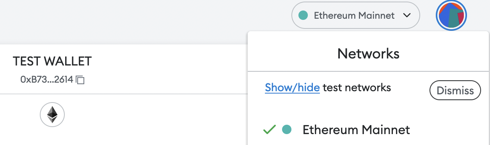

# Harpie Frontend Engineer Personal Project

# TASK: Create a button that interacts with the Ethereum blockchain
We'll be making a React button component that interacts with an Ethereum smart contract using ethers.js.

This project will test concepts that may be slightly or completely foreign to you. This readme provides resources to ensure that you're able to learn as you complete the project.

## INSTRUCTIONS:
* install `facebook/create-react-app` inside this repo, or another repo of your choosing
* install MetaMask using this link: https://metamask.io/download/
* navigate to the "Goerli Testnet" by turning on test networks: 
* install `ethers.js`
* create a component called ConnectButton that opens up MetaMask and allows you to connect your MetaMask wallet to your page
* create a component called ContractButton that calls the `approve` method upon a smart contract, on the behalf of the connected wallet
    * The contract address you're interacting with is `0xBA62BCfcAaFc6622853cca2BE6Ac7d845BC0f2Dc`
    * The first parameter should be your wallet address, and the second parameter should be 0.
    * https://docs.openzeppelin.com/contracts/2.x/api/token/erc20#IERC20-approve-address-uint256-

## SPECS: 
* As you may be unfamiliar with crypto tech, a slideshow of an example successful project can be found here: https://drive.google.com/file/d/16X42HnfGwb5f8DmozpSYljn8css3QlCL/view?usp=sharing
* if you've already connected your wallet to your app, your ConnectButton will not appear to do anything. As long as ContractButton works properly, you've completed the project!

## HINTS:
* `approve` is a state changing method, so you'll need to use a `Signer`
* your ConnectButton function and ContractButton function will both be async functions
* don't forget to switch to the Goerli testnet!
* there's no need for a complete understanding of what you're working on in this project. 
this is a difficult assignment, and complete comprehension is not an expectation
* feel free to email Daniel at any time for questions

## LINKS:
* ethereum basics: https://ethereum.org/en/what-is-ethereum/
* getting started with ethers.js: https://docs.ethers.io/v5/getting-started/#getting-started--contracts
* google keywords that might help you: "metamask ethers.js" "ethers.js with react" "call contract ethers.js"
* abi of contract `0xBA62...`: http://api-goerli.etherscan.io/api?module=contract&action=getabi&address=0xba62bcfcaafc6622853cca2be6ac7d845bc0f2dc&format=raw

Good luck!

## START UP:
run the following to get the app up

`npm install`

`npm start`

Open [http://localhost:3000](http://localhost:3000) to view it in your browser.